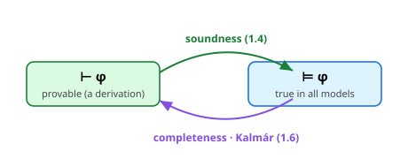
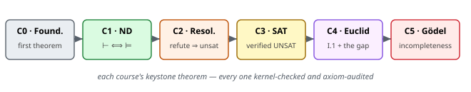

<!--
The whole-course map: what every concept builds, where it sits in the library, and where to find it.
Read this first to see the forest; read each concept's own explainer.qmd for the trees.
Figures are hand-authored SVG in figs/ (render in both HTML and the Typst PDF).
-->

## 1. What this is

**Principia** is a real, kernel-verified Lean 4 library, built **from scratch with no Mathlib**, one
concept at a time — and it is a *course*: **25 self-contained concepts** grouped into **6 courses**.
Through building the library you learn theorem proving itself, from "what is a proof?" to the logical
heart of Gödel's incompleteness. Each concept is a small lesson — a deep explainer, a `Skeleton.lean` you
fill in, a verified `Solution.lean`, and machine checks — and each *course* delivers a complete, verified
capability: two provers, a SAT toolkit, honest geometry, and abstract incompleteness.

Two ideas hold the whole thing together:

- **The oracle is the kernel — and it is read-only.** A `sorry`-free `lake build` *is* a machine-checked
  proof; that is the grade. On top of it, an **axiom auditor** (`make axioms`) runs `#print axioms` on
  every keystone and fails on any `sorryAx` or ad-hoc `axiom` — so we can never fudge a proof to pass.
  We fix the proof (or the statement), never weaken it.
- **The library grows along a spine.** A tiny core — `Logic` (syntax + semantics) — is reused by the two
  provers and the SAT solver; geometry and Gödel stand as independent islands. Build the spine once and
  everything downstream imports it.

{width=92%}

The rest of this document walks the architecture, then the courses one by one, then indexes every concept
to its place in the library and its folder on disk.

## 2. The architecture, layer by layer

A verified library is a tower of definitions and the theorems that connect them. Principia's layers:

| Layer | Job | Key contents | Built in |
|---|---|---|---|
| **Logic** | the object language | `Form` (formulas), `eval`, `Tautology`/`⊨`, a runnable `taut?` | `01-natural-deduction/{01,02}` |
| **NatDed** | a proof *system* + its metatheory | `Deriv` (`⊢`), soundness, a prover, completeness | `01-natural-deduction/{03–06}` |
| **Resolution** | a refutation calculus | CNF, `resolvent`, `Refut`, soundness, a decision procedure | `02-resolution/{01–05}` |
| **Sat** | practical satisfiability | `assign`, DPLL, CDCL, a verified LRAT checker | `03-sat/{01–04}` |
| **Euclid** | synthetic geometry | `EuclidPlane` axioms, Prop I.1, the five-segment (SAS) axiom | `04-euclid/{01,02}` |
| **Goedel** | abstract incompleteness | the diagonal lemma, Tarski, the first incompleteness theorem | `05-goedel/{01–03}` |

**`Logic` is the hinge.** `Form` and `eval`/`⊨` are defined once and reused everywhere above: `NatDed`
proves theorems *about* `⊨`, `Resolution` reduces tautology-checking to CNF-unsatisfiability of the same
`eval`, and `Sat` reuses `Resolution`'s clause representation wholesale. That is why the first two
concepts (syntax, semantics) pay for the next fourteen.

### The recurring idea: two views of truth, and the bridge between them

The deepest theme of the logic courses is the gap between **syntax** (`⊢ φ`: there is a derivation) and
**semantics** (`⊨ φ`: true in every model), and the theorems that bridge it.

{width=58%}

That same *syntax ⟺ semantics* shape returns as a refrain: **soundness** is always the easy half (a
*yes* carries a witness you can check), **completeness** the hard half (a global claim). You meet it in
Course 1 (`⊢ ⟺ ⊨`), again in Course 2 (resolution soundness is easy; refutation-completeness is
research-grade and honestly scoped), and again in Course 3 (a SAT *model* is locally checkable, but a
trustworthy *UNSAT* needs a certificate). Learn it once and you see it everywhere.

## 3. The build, course by course

Each course takes the library from the previous one and grows it, ending in a complete, verified
capability.

{width=98%}

- **Course 0 — Foundations** (`00-foundations/00–04`). Lean and proof from zero: a first `theorem`, `Nat`
  induction, the connectives via intro/elim, inductive types + recursion (a baby soundness theorem,
  `eval_swap`), and natural deduction shown *as* Lean's own tactics — the bridge into Course 1.
- **Course 1 — Natural deduction** (`01-natural-deduction/01–06`). The first capstone: define formulas
  and their truth (`Logic`), the derivation system `⊢` (`Deriv`, with classical RAA), prove **soundness**
  (`⊢ ⇒ ⊨`), build a **prover** (typed proof search — sound by construction), and prove **completeness**
  by Kalmár's elementary method — closing the loop `provable_iff_tautology : Nonempty (⊢ φ) ↔ ⊨ φ`.
- **Course 2 — Resolution** (`02-resolution/01–05`). A second, different prover: convert to CNF (with
  `Tautology φ ↔ (toCnf false φ).Unsat`), the resolution rule and `Refut` (intrinsically-typed
  refutations), a fuel-bounded saturation prover, and **soundness** (`Refut S [] ⇒ S.Unsat`). Full
  refutation-completeness over list-clauses is flagged as research-grade and scoped.
- **Course 3 — SAT** (`03-sat/01–04`). The practical workhorse, both sides of a trustworthy pipeline:
  `assign` + satisfiability preservation, **DPLL** with **model soundness**, a **CDCL** solver (clause
  learning + backjumping; unverified but differential-tested against DPLL), and the keystone — a
  **verified LRAT certificate checker** (`check proof cnf → cnf.Unsat`), how real verified UNSAT works.
- **Course 4 — Euclid** (`04-euclid/01–02`). Synthetic geometry made honest: the postulates as a `class`
  (no `axiom` keyword), **Prop I.1** (the equilateral triangle) with its hidden **continuity gap** made
  explicit, then **betweenness** and the **five-segment axiom** — Tarski's angle-free SAS — with segment
  addition. Figure-rich (the construction; the ℚ² counterexample; the SAS configuration).
- **Course 5 — Gödel** (`05-goedel/01–03`). The finale, abstractly: **Lawvere's fixed-point theorem**
  (the diagonal argument, distilled) with Cantor, then **Tarski's undefinability of truth**, then the
  **abstract first incompleteness theorem** — all the same diagonal under different substitutions
  (truth, provability). The diagonal lemma's discharge — arithmetisation — is honestly scoped.

## 4. Full concept index

Every concept is a folder `NN-course/MM-concept/`. The library module tells you *where it lives in the
tower*; the path tells you *where it lives on disk*.

| # | Concept (folder) | Graduates into | What you build |
|---|---|---|---|
| 00 | `00-foundations/00-setup` | — | the loop end-to-end; a first proof |
| 01 | `00-foundations/01-naturals` | — | `Nat` + induction (NNG-style) |
| 02 | `00-foundations/02-propositions` | — | connectives via intro/elim |
| 03 | `00-foundations/03-recursion` | — | inductive types; `eval_swap` |
| 04 | `00-foundations/04-logic` | — | natural deduction ↔ tactics |
| 05 | `01-natural-deduction/01-syntax` | `Logic/Syntax` | `Form`; notation `⇒ ⋏ ⋎ ∼ ⊥` |
| 06 | `01-natural-deduction/02-semantics` | `Logic/Semantics` | `eval`, `⊨`, runnable `taut?` |
| 07 | `01-natural-deduction/03-deduction` | `NatDed/Basic` | `Deriv` (`⊢`); Peirce by hand |
| 08 | `01-natural-deduction/04-soundness` | `NatDed/Soundness` | **`soundness : ⊢ ⇒ ⊨`** |
| 09 | `01-natural-deduction/05-prover` | `NatDed/Prover` | typed proof search (`prove?`) |
| 10 | `01-natural-deduction/06-completeness` | `NatDed/Kalmar`,`Completeness` | **`provable_iff_tautology`** |
| 11 | `02-resolution/01-cnf` | `Resolution/Cnf` | CNF; `taut_iff_cnf_unsat` |
| 12 | `02-resolution/02-rule` | `Resolution/Rule` | `resolvent`, `Refut` |
| 13 | `02-resolution/03-prover` | `Resolution/Prover` | fuel-bounded saturation |
| 14 | `02-resolution/04-soundness` | `Resolution/Soundness` | **`refut_unsat`** |
| 15 | `02-resolution/05-completeness` | `Resolution/Completeness` | decision procedure; the scoped keystone |
| 16 | `03-sat/01-assign` | `Sat/Basic` | `assign`; `sat_of_assign` |
| 17 | `03-sat/02-dpll` | `Sat/Dpll` | DPLL; **`dpll_sound`** |
| 18 | `03-sat/03-lrat` | `Sat/Lrat` | **`check_unsat`** (verified UNSAT) |
| 19 | `03-sat/04-cdcl` | `Sat/Cdcl` | CDCL (learning + backjumping) |
| 20 | `04-euclid/01-equilateral` | `Euclid/Basic` | `EuclidPlane`; **`prop_I1`** |
| 21 | `04-euclid/02-betweenness` | `Euclid/Betweenness` | five-segment (SAS); **`segment_add`** |
| 22 | `05-goedel/01-diagonal` | `Goedel/Diagonal` | **`lawvere`**, `cantor`, `no_self_neg` |
| 23 | `05-goedel/02-tarski` | `Goedel/Tarski` | **`tarski`** (truth undefinable) |
| 24 | `05-goedel/03-incompleteness` | `Goedel/Incompleteness` | **`incompleteness`** (Gödel I) |

## 5. How a concept is built (and how to run it)

Every concept folder has the same shape (template in `_TEMPLATE-concept/`):

```
NN-concept/
├── README.md       # objective, the rung ladder, definition of done
├── explainer.qmd   # THE LESSON — concept-first, from zero (renders to HTML + PDF in place)
├── Skeleton.lean   # the statements with `sorry` holes — RED (set_option warningAsError true)
├── Solution.lean   # the verified answer key + a ## Checks block — GREEN
└── figs/           # (optional) hand-authored SVG diagrams
```

**The skeleton↔solution toggle.** `sorry` is only a *warning* in Lean, so each `Skeleton.lean` opens with
`set_option warningAsError true` — turning a leftover `sorry` into a hard error. So `make lab` is **RED**
until you supply real proofs, and **GREEN** once you do. Concept files live *outside* the `Principia`
library glob and are checked standalone (`lake env lean`), so skeletons never break the library build, and
verified code **graduates** into `Principia/` for later concepts to import.

### The three testing tiers

- **Tier 1 — formal proof** (the default): the kernel grades it; `Skeleton`'s `sorry` → `Solution`'s proof.
- **Tier 2 — computational**: `#eval`/`#guard`/`decide` run the prover/solver on concrete inputs (e.g.
  `taut?`, `dpll`, `check`).
- **Tier 3 — differential**: hold code honest against an oracle — e.g. CDCL's verdicts are `#guard`ed to
  agree with the *verified* DPLL; geometry is checked against explicit models.

### Course tooling

```sh
make build                              # build the Principia library (GREEN)
make test                               # build every Solution.lean + run its checks (GREEN)
make lab C=03-sat/03-lrat               # build one concept's Skeleton.lean (RED → GREEN)
make axioms                             # audit keystones: fail on sorryAx / stray axiom
make explainer C=05-goedel/01-diagonal  # render one lesson to HTML + PDF, in place
make docs                               # render every explainer (and this map)
```

A typical session: pick a concept, read its `explainer.qmd`, run `make lab C=<dir>` (red), discharge the
`sorry`s until it's green, then move on — the library has grown by one verified capability.

## 6. The keystones, audited

Each course's headline theorem, and what `#print axioms` reports (only `propext`/`Classical.choice`/
`Quot.sound` are acceptable; most are axiom-free):

| Course | Keystone | Statement | Axioms |
|---|---|---|---|
| 1 | `soundness` | `Γ ⊢ φ → Γ ⊨ φ` | clean |
| 1 | `provable_iff_tautology` | `Nonempty ([] ⊢ φ) ↔ Tautology φ` | propext, Quot.sound |
| 2 | `taut_iff_cnf_unsat` | `Tautology φ ↔ (toCnf false φ).Unsat` | clean |
| 2 | `refut_unsat` | `Refut S [] → S.Unsat` | clean |
| 3 | `dpll_sound` | `dpll fuel cnf = some ls → Cnf.satBy ls cnf` | clean |
| 3 | `check_unsat` | `check cnf proof = true → cnf.Unsat` | clean |
| 4 | `prop_I1` | an equilateral triangle on any segment | **none** |
| 4 | `segment_add` | congruent parts ⇒ congruent wholes (l2_11) | **none** |
| 5 | `lawvere` | point-surjection ⇒ every endo-map has a fixed point | **none** |
| 5 | `tarski` | a language's truth predicate is not definable | **none** |
| 5 | `incompleteness` | a true, unprovable, irrefutable sentence exists | **none** |

The geometry and Gödel keystones depend on **no Lean axioms at all**: their assumptions are *class fields*
(geometric postulates; the diagonal lemma), so the theorems are parametric over every model — and the
honest scoping is visible in the source, not hidden in an `axiom`.

## 7. How we know it works

- **The kernel.** Every `Solution.lean` and every `Principia/` module type-checks with zero `sorry`; that
  is a complete, machine-checked proof of each theorem.
- **The axiom auditor.** `make axioms` greps the tree for stray `sorry`/`axiom` and scans `#print axioms`
  of the keystones — so "verified" means verified *all the way down*, with the trusted base spelled out.
- **Computation & differential checks.** Provers and solvers are *run* (`#eval`/`#guard`), and the one
  unverified component (CDCL) is differential-tested against a verified reference.
- **Honest scope, in the open.** Where a full result is research-grade — resolution refutation-completeness,
  the general SAS/I.5, Gödel's arithmetisation — we deliver the tractable core and *flag* the gap as a
  named hypothesis, never as a silent `axiom` or a weakened statement.

**The shape of the whole thing:** one small logical spine; two provers and a SAT toolkit built on it;
geometry and incompleteness as honest islands; and, at every step, the Lean kernel as the judge. Read on
into any `NN-course/MM-concept/explainer.qmd` — you now know exactly where it sits in the library.
